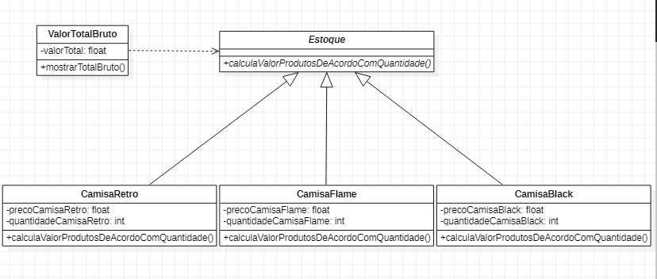

<h1 align="center">Orientação a Objetos</h1>

Aplicação de um <strong>Cálculo de Valor Bruto </strong> através de um estoque com três modelos de camisas. Projeto feito para a UFJF.

Nome: Giovane Machado Aguiar 

Matrícula: 201876019

  
 

   <h2> Modelagem da Aplicação através da ferramenta StarUML </h2>

